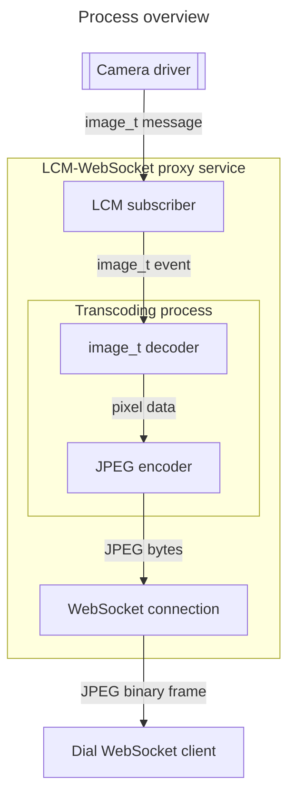

# LCM-WebSocket Image Transcoding Proxy Service

*Author:* Kevin Barnard

## Overview

This document outlines a proposed service and process for performing real-time transcoding of image data received via LCM and transmitted via WebSocket connections.

These aim to increase performance for [Dial](https://github.com/mbari-org/dial) by replacing the transcoding and transmission mechanism for images. Instead of transcoding `image_t` messages to JSON by hex-encoding the image bytes as-is, this process decodes image data and encodes it as a JPEG. This offers several benefits:

1. **Abstraction to the driver's image pixel encoding**: This process takes over the responsibility of decoding the image data from the consumer. The consumer can expect JPEG images and does not need to consider the image metadata (namely the pixel format).
2. **Bandwidth reduction**: JPEGs are lightweight. In most cases, the camera driver publishes raw Bayer or RGB data, the retransmission of which should be avoided.
3. **Control**: The parameters related to the image encoding can be tweaked as desired according to the requirements of the consumer process.

## Implementation details

This service will be implemented in Python using the following libraries:
- [LCM](https://lcm-proj.github.io/lcm/)
- [OpenCV](https://docs.opencv.org/4.x/index.html)
- [websockets](https://websockets.readthedocs.io/en/stable/index.html)
- The [compas_lcmtypes](https://github.com/CoMPASLab/compas_lcmtypes) LCM type packages:
	- `stdlcm`
	- `senlcm`
	- `navlcm`
	- `geolcm`

Messages will be [received](https://lcm-proj.github.io/lcm/python/index.html#lcm.LCM) via LCM and decoded according to the [`image_t` definition](https://github.com/CoMPASLab/compas_lcmtypes/blob/main/senlcm_image_t.lcm). The contained image data will be decoded according to the specified pixel format then [encoded](https://docs.opencv.org/4.x/d4/da8/group__imgcodecs.html#ga5a0acefe5cbe0a81e904e452ec7ca733) into JPEG using OpenCV. The JPEG byte data will be [sent](https://websockets.readthedocs.io/en/stable/reference/asyncio/server.html#websockets.server.WebSocketServerProtocol.send) over WebSocket connections as a [Binary frame](https://www.rfc-editor.org/rfc/rfc6455.html#section-5.6).